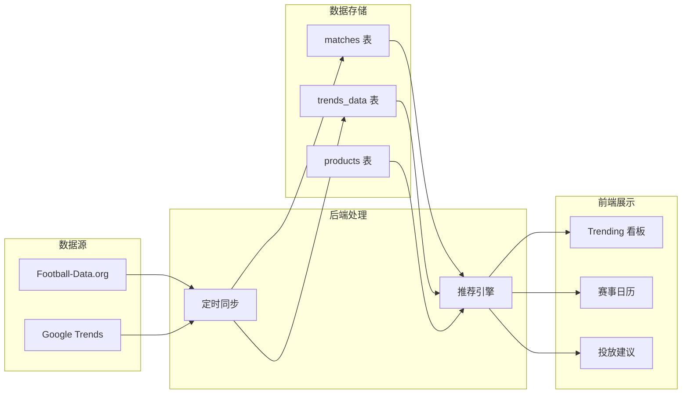

# Trending 推荐系统

## 系统概述

整合足球赛事 API 和 Google Trends 数据，构建一个智能投放推荐系统：

- 根据未来 14 天的比赛日程，预测哪些球队会有热度
- 结合 Google Trends 实时数据验证和发现额外热点
- 针对不同目标国家（DE/UK/FR/US）推荐最佳投放的球队和产品



---

## Phase 1: 足球赛事数据接入

### API 选择: Football-Data.org

| 特性 | 说明 |
|------|------|
| 免费层 | 10 次/分钟，支持主要联赛 |
| 覆盖联赛 | 英超、德甲、法甲、欧冠、欧联、非洲杯 |
| 数据内容 | 赛程、球队、比分、积分榜 |
| 费用 | 免费版足够，付费版 $12/月 |

### 数据库设计

新建表 `football_matches`:

```sql
CREATE TABLE football_matches (
  id UUID PRIMARY KEY DEFAULT gen_random_uuid(),
  match_id INTEGER UNIQUE,           -- API 返回的比赛 ID
  competition_code TEXT,             -- 联赛代码: PL, BL1, FL1, CL, EL, CLI
  competition_name TEXT,             -- 联赛名称
  home_team TEXT,
  away_team TEXT,
  home_team_crest TEXT,              -- 队徽 URL
  away_team_crest TEXT,
  match_date TIMESTAMPTZ,
  status TEXT,                       -- SCHEDULED, FINISHED, IN_PLAY
  home_score INTEGER,
  away_score INTEGER,
  target_countries TEXT[],           -- 目标投放国家: ['DE', 'UK', 'FR']
  synced_at TIMESTAMPTZ DEFAULT NOW()
);
```

### Edge Function: `football-sync`

新建 Supabase Edge Function `supabase/functions/football-sync/index.ts`:
- 定时拉取未来 14 天比赛
- 支持的联赛: PL(英超), BL1(德甲), FL1(法甲), CL(欧冠), EL(欧联), CLI(非洲杯)
- 球队名与产品 `attributes.team` 自动匹配

---

## Phase 2: Google Trends 接入

### 方案选择: SerpAPI (推荐)

Google 没有官方 Trends API，推荐使用 SerpAPI：

| 方案 | 优点 | 缺点 |
|------|------|------|
| **SerpAPI** | 稳定、可靠、有官方支持 | $50/月起 |
| PyTrends | 免费 | 不稳定，易被封 |
| Pytrends + Proxy | 便宜 | 维护成本高 |

### 数据库设计

新建表 `trends_data`:

```sql
CREATE TABLE trends_data (
  id UUID PRIMARY KEY DEFAULT gen_random_uuid(),
  keyword TEXT,                      -- 搜索关键词（球队名）
  country_code TEXT,                 -- 国家: DE, UK, FR, US
  interest_score INTEGER,            -- 热度分数 0-100
  trend_direction TEXT,              -- rising, stable, declining
  related_queries JSONB,             -- 相关搜索词
  data_date DATE,
  synced_at TIMESTAMPTZ DEFAULT NOW()
);
```

### Edge Function: `trends-sync`

新建 `supabase/functions/trends-sync/index.ts`:
- 基于比赛日程中的球队查询 Google Trends
- 分国家获取搜索热度
- 每日同步一次

---

## Phase 3: 推荐引擎

### 推荐逻辑

```typescript
// 推荐分数计算
score = (match_importance * 40) + (trends_score * 30) + (inventory_score * 20) + (sales_history * 10)

// match_importance: 联赛重要性 + 天数临近度
// trends_score: Google Trends 热度
// inventory_score: 是否有库存
// sales_history: 历史销量
```

### 新增数据库表 `trending_recommendations`:

```sql
CREATE TABLE trending_recommendations (
  id UUID PRIMARY KEY DEFAULT gen_random_uuid(),
  team_name TEXT,
  target_country TEXT,               -- DE, UK, FR, US
  recommendation_date DATE,
  score NUMERIC,
  factors JSONB,                     -- { match: {...}, trends: {...}, inventory: {...} }
  matched_skus TEXT[],               -- 匹配的产品 SKU
  created_at TIMESTAMPTZ DEFAULT NOW()
);
```

---

## Phase 4: 前端界面

### 新增页面: `src/pages/TrendingPage.tsx`

包含三个主要视图：

1. **赛事日历**
   - 未来 14 天比赛日程
   - 按联赛/日期筛选
   - 点击比赛查看关联产品

2. **Trending 看板**
   - 各国家热门球队排行
   - Google Trends 热度曲线
   - 实时热点发现

3. **投放建议**
   - 按国家分组的推荐列表
   - 推荐原因说明（即将比赛/搜索热度上升）
   - 一键跳转到产品列表

---

## 技术栈

| 组件 | 技术 |
|------|------|
| 足球 API | Football-Data.org (免费版) |
| Trends API | SerpAPI 或 PyTrends |
| 后端 | Supabase Edge Functions |
| 定时任务 | Supabase Cron 或 Vercel Cron |
| 前端 | React + TanStack Query |
| 可视化 | Recharts (已有) |

---

## 开发顺序

1. 先接入 Football-Data.org（免费，可立即开始）
2. 实现赛事日历 UI
3. 球队-产品自动匹配逻辑
4. 接入 Google Trends（需要评估 SerpAPI 成本）
5. 实现推荐引擎
6. 投放建议界面

---

## 费用估算

| 服务 | 费用/月 |
|------|---------|
| Football-Data.org | 免费（或 $12） |
| SerpAPI | $50 起 |
| Supabase | 已有 |
| **总计** | $50-62/月 |

如果不想用 SerpAPI，可以先只用足球赛事数据，后续再评估 Trends 的必要性。
